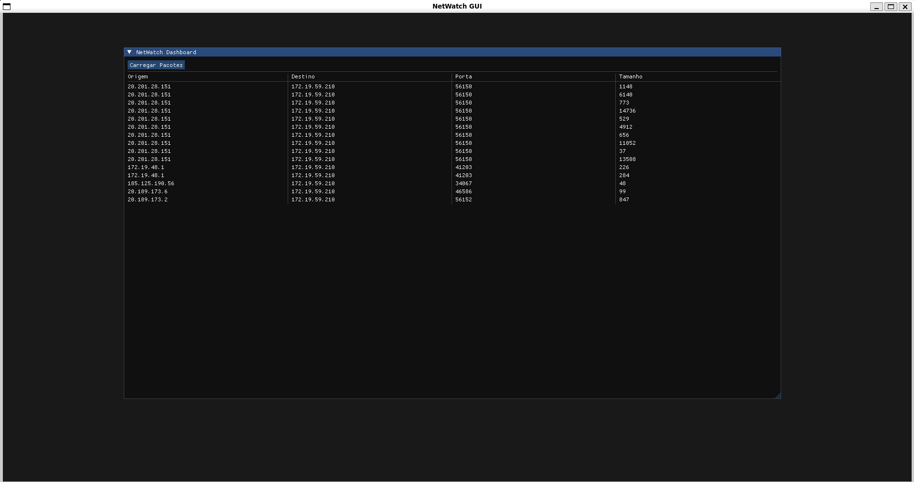
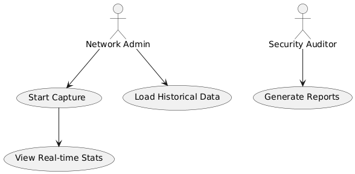
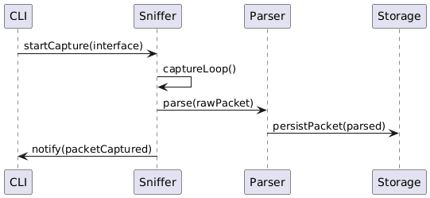
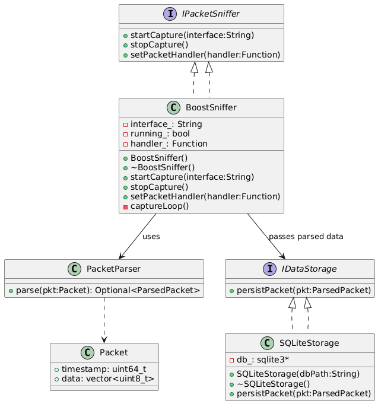
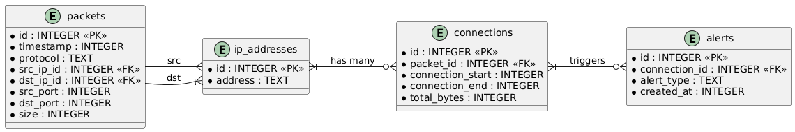

# NetWatch - Professional Network Traffic Monitor

## Overview

NetWatch is a high-performance network traffic monitoring application developed in C++ using Boost.Asio. It captures and analyzes TCP and UDP packets, displaying metadata such as source/destination IPs, ports, protocols, and packet sizes. Designed with scalability and modularity in mind, it simulates enterprise-grade network visibility tools.


NetWatch was developed as a proof-of-concept for SecureNet Intelligence. The firm needed a lightweight, portable tool to monitor internal network activity for performance analytics and early threat detection in small to medium-sized corporate networks.

---

## Technologies & Justifications

### Programming Language

* **C++17**: Performance, memory control (RAII, move semantics).

### Asynchronous Networking

* **Boost.Asio**: Cross-platform, asynchronous TCP/UDP socket handling.

### Concurrency

* **std::thread / Boost.Thread**: Parallel packet capture and processing.

### Parsing

* **Custom parsers**: Dissect IPv4, TCP, and UDP headers for metadata extraction.

### Persistence

* **SQLite (default)**: Embedded DB for local packet metadata storage.
* **PostgreSQL (optional)**: For centralized, scalable deployments.
* **TimescaleDB (optional)**: Time-series analytics on packet streams.

---

## Project Structure

```text
NetWatch/
├── CMakeLists.txt          # Build configuration
├── src/                    # Source code
│   ├── main.cpp            # Application entry point (CLI)
│   ├── network/            # Boost.Asio sniffer implementation
│   ├── parser/             # PacketParser for IPv4/TCP/UDP
│   ├── storage/            # SQLiteStorage implementation
│   └── utils/              # Logging, helpers
├── include/                # Public headers
│   └── netwatch/
│       ├── network/
│       ├── parser/
│       └── storage/
├── imgui/                  # Dear ImGui submodule
├── NetWatchGUI.cpp         # ImGui-based GUI
├── build/                  # Out-of-source build directory
├── scripts/                # SQL init & insert scripts
├── packets.db              # Sample database (after init)
└── README.md               # Project documentation
```

---

## Diagrams (in `/diagrams`)

### 1. Use Case Diagram


*Legend:* This diagram illustrates the primary actors and their interactions with NetWatch. The **Network Admin** starts and stops captures and views live statistics, while the **Security Auditor** focuses on historical data and report generation.

### 2. Sequence Diagram Sequence Diagram


*Legend:* This sequence shows the flow of a raw packet from capture to storage: the CLI triggers the sniffer, which loops to capture packets, sends raw data to the parser, and then persists the parsed result before notifying the CLI.

### 3. Class Diagram



*Legend:* This expanded class diagram details each class's attributes and methods, showing how `BoostSniffer` implements `IPacketSniffer`, interacts with `PacketParser`, and delegates persistence to `SQLiteStorage` via the `IDataStorage` interface.\* Highlights the core classes and their relationships: `BoostSniffer` implements `IPacketSniffer`, `PacketParser` parses raw data into `Packet`, and `SQLiteStorage` implements the `IDataStorage` interface for persistence.

### 4. Deployment Diagram


*Legend:* Depicts the runtime environment: the NetWatch agent runs on client machines writing to a central database server, while the GUI dashboard reads from that database for visualization.

### 5. ER Diagram (Database)


*Legend:* This ER model expands data normalization: `ip_addresses` stores unique IPs, `packets` reference them via foreign keys, `connections` track session metadata across packets, and `alerts` record security events triggered by connection patterns. Shows the schema for the `packets` table: each row records a unique packet with its timestamp, protocol, endpoints, and payload size.

---

## Building & Running

### 1. Clone & Setup Submodule

```bash
git clone --recurse-submodules https://github.com/your-user/NetWatch.git
cd NetWatch
```

### 2. Build CLI Application

```bash
mkdir build && cd build
cmake ..
make -j$(nproc)
```

#### Run CLI

```bash
sudo ./NetWatch eth0 packets.db
```

### 3. Initialize Database (Hardcoded Example)

```bash
mkdir -p scripts
# Create and populate table
sqlite3 packets.db < scripts/init_packets.sql
sqlite3 packets.db < scripts/insert_packets.sql
```

### 4. Build & Run GUI

```bash
# In project root
g++ NetWatchGUI.cpp \
    imgui/*.cpp \
    imgui/backends/imgui_impl_glfw.cpp \
    imgui/backends/imgui_impl_opengl3.cpp \
    -Iimgui -Iimgui/backends \
    -lglfw -lGL -ldl -lpthread -lsqlite3 \
    -o NetWatchGUI
./NetWatchGUI
```

---

## Future Enhancements

* Real-time charts with ImPlot
* Filters by IP, port, protocol
* Integration with PostgreSQL/TimescaleDB
* REST API + React dashboard

---

## Authors

* Victor Carlota (Lead Developer)

---

## Contributions

Feel free to fork and submit pull requests. Happy monitoring!
